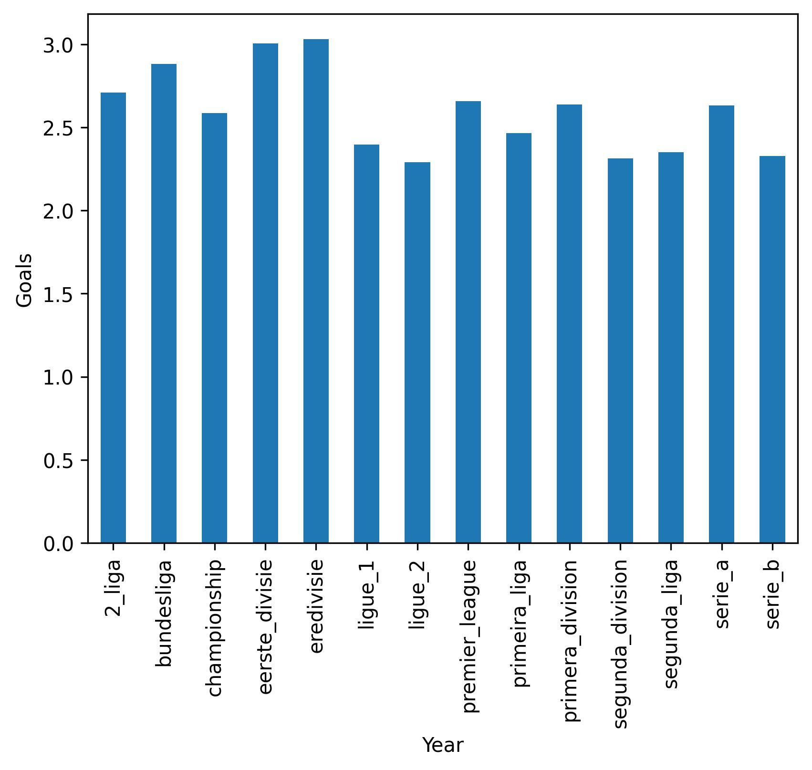
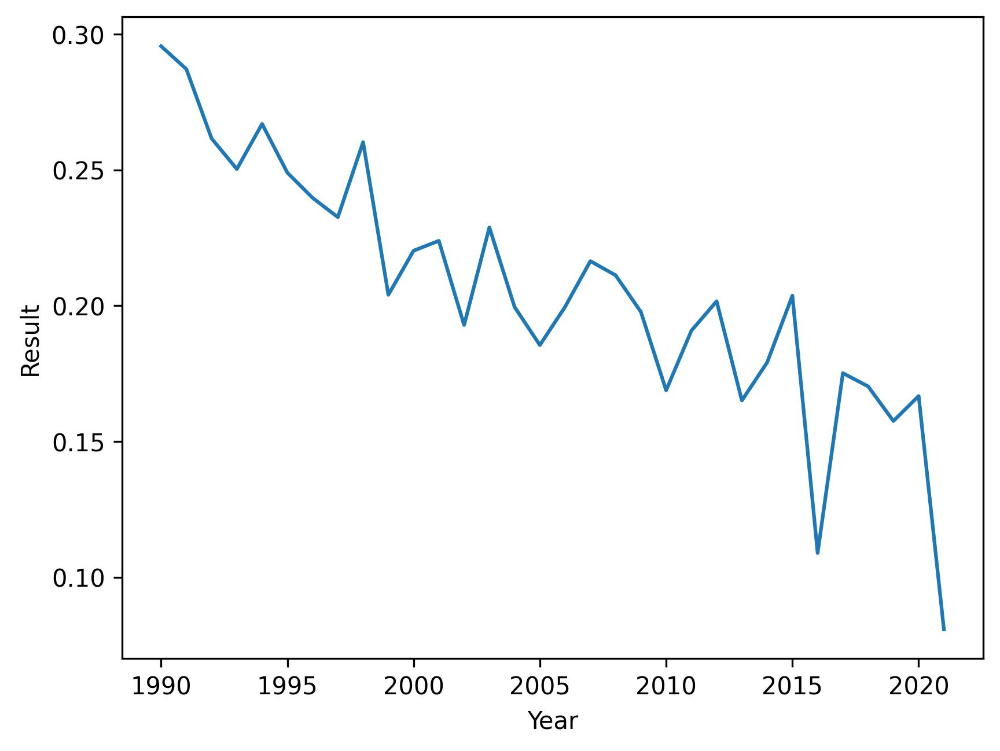
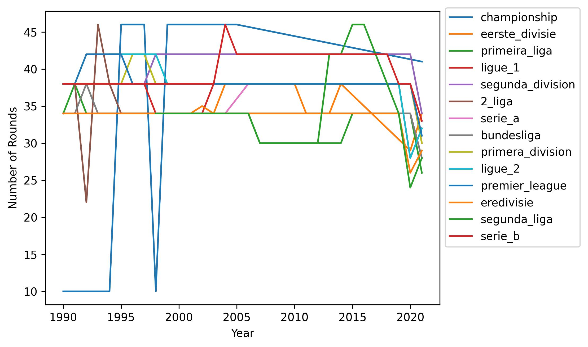

# Football Outcome Predictions
My forth and final project for AiCore. Building a machine learning model to make predictions for upcoming games and set odds for betting companies to maximise profit.

## Milestone 1: Project Setup

- A new conda environment has been set up with the name ```football-env``` from which the package requirements needed for the projects can be created in a ```requirements.txt``` file. Git branches will be used throughout the project following the Gitflow branching model.

<p align='center'>
  
</p>

> The simplified Gitflow branching model.

## Milestone 2: Data Cleaning and EDA

Exploratory Data Analysis (EDA) is the first step that must be undertaken before creating any form of model. It involves validating that the data provided is clean and free of missing values so as not to cause problems when working with such large quanities of data later down the line. By exploring this data, a rough understanding of the underlying trends between the variables can begin to be established.

### Data Cleaning

After concatenating the data provided into a singular dataframe ```match_df``` and running the ```describe()``` method on it, several key pieces of information show up:
  - The data contains information from ```146498``` matches spanning ```32``` years across ```14``` different leagues.
  - There is a discrepancy between the total number of links (```146498```) and the number of unique links (```132113```). Reasons for this could be some matches do not contain a link, contain the wrong link or there may be duplicates of matches in the dataframe.
  - There is a discrepancy between the number of unique home teams (```538```) and the number of unique away teams (```545```). These too, should in theory have the same value.

The data is cleaned with a function perfoming the following:
- Duplicated rows with identical links removed with ```df.drop_duplicates('Link', inplace=True)```. Using ```match_df[match_df.duplicated('clean_link', keep=False)]```, it is revealed that the problem leagues containing the majority of duplicates are the Eerste Divisie and Segunda Liga, with a small minority from Ligue 1 and Serie B.

### Analysis

Not every row contains correctly formatted data. These rows will be dealt with later, however for now they are simply removed from the dataframe in order to analyse the overall trends that are present. This leaves ```142105``` rows to explore.

Combining the home and away goals, a bar chart can be produced to show the average number of goals per game for the various leagues. As can be seen, all the leagues have a similar average of around ```2.5``` goals per game, with the Dutch Eredivisie coming in at the highest with an avergae of about ```3```, and the French Ligue 2 the lowest at roughly ```2.3``` goals per game.

<p align='center'>
  
</p>

> The average number of goals per game.

By creating a new column in the dataframe and assigning each home win, draw and away win a score of ```1```, ```0``` and ```-1``` respectively, a line graph can be plotted to see how the average outcome of all leagues has changed over the years. In theory, this value would remain at ```0``` indicating the same number of home and away wins, however in reality we that the earlier years had a heavy bias towards home wins. What is interesting is that over the years, this bias is reducing leading to a much more equal probability of the away team winning especially in recent years.

<p align='center'>
  
</p>

> The outcome of game over time.

The number of rounds in each season for each league is plotted as a function of time. While this figure is a little convoluted, it is useful to observe potential gaps in the dataset. It is to be expected that each league plays ```30```-```45``` rounds, so it is evident the Championship is a problmeatic dataset. After inspecting, it can be seen that there is incomplete data for the years ```1990```-```1994``` and ```1998```, and missing data between ```2006``` and ```2020```. The drop in rounds in the 2. Bundesliga in ```1992``` may initially be understood as incomplete data, however after futher research it is apparent that this is due to the league being briefly split in two after teams from East Germany joined the league. There is also several years of data missing for the Eerste Divisie, Serie A, Ligue 2 and Segunda Liga. The final two dips in total rounds played can be by the COVID-19 pandemic in ```2020``` which cut many seasons short, and the data being collected while the ```2021``` campaign was still in progression.

<p align='center'>
  
</p>

> The number of rounds in each league.

## Milestone 3: Feature Engineering

## Milestone 4: Uploading to a Database

## Milestone 5: Model Training

## Milestone 6: Inference
