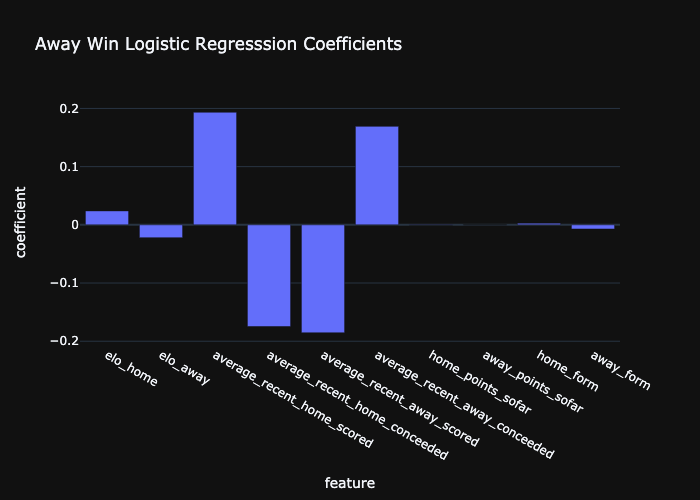
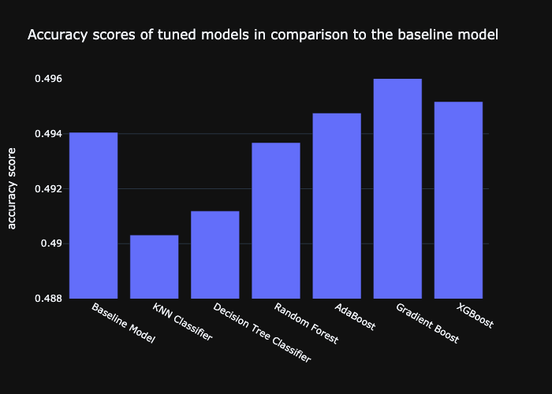

# Football Outcome Predictions
My forth and final project for AiCore. Building a machine learning model to make predictions for upcoming football matches.

## Milestone 1: Project Setup

- A new conda environment `football-env` is set up so the package requirements needed for the project can be written to `requirements.txt` in order for other uses to downloade these with ease. Git branches will be used throughout the project following the Gitflow branching model.

<p align='center'>
  
</p>

> The simplified Gitflow branching model.

## Milestone 2: Data Cleaning and EDA

Exploratory Data Analysis (EDA) is the first step that must be undertaken before creating any form of model. It involves validating that the data provided is clean and free of missing values so as not to cause problems when working with this large quanity of data later. By exploring this data, a rough understanding of the underlying trends between the variables can begin to be established.

### Data Cleaning

After concatenating the data provided into a singular dataframe `main_df` and running the `describe()` method on it, several key pieces of information show up:
- The data contains information from 142536 matches spanning 32 years across 14 different leagues.
- There is a discrepancy between the total number of links (142536) and the number of unique links (128379). Reasons for this could be some matches do not contain a link, contain the wrong link or there may be duplicates of matches in the dataframe.
- There is a discrepancy between the number of unique home teams (533) and the number of unique away teams (540). These too, should in theory have the same value.

Missing data can be visualised using the `missingno` package and running ```missingno.matix(main_df)```.

<p align='center'>
  
</p>

> Gaps in the plot show missing values such as `NaN`.

The data is cleaned with a function perfoming the following:
- Duplicated rows with identical links removed with `match_df.drop_duplicates('clean_link', inplace=True)`. Using `main_df[main_df.duplicated('clean_link', keep=False)]`, it is revealed that the problem leagues containing the majority of duplicates are the Eerste Divisie and Segunda Liga, with a small minority from Ligue 1 and Serie B.
- The `referee` column is cleaned up to remove the `\r\n` on either side of the name. Care is taken when applying the `clean_referee()` function to the series to avoid any `NaN` floats. 
- The `date_new` column is converted from an `object` to a `datetime64` datatype.
- The ```capacity``` column is cleaned and converted to an integer value where the value is not ```NaN```.

```python
df['referee'] = df['referee'].apply(lambda x: x.split('\r\n')[1][9:] if type(x)==str else x)
df['date_new'] = pd.to_datetime(df['date_new'])
df['capacity'] = df['capacity'].apply(lambda x: int(x.replace(',', '')) if type(x)==str else x)
```
> Cleaning the `referee`,`date_new` and `capacity` columns.

The number of rounds in each season for each league is plotted as a function of time. While this figure is a little convoluted, it is useful to observe potential gaps in the dataset.

<p align='center'>
  
</p>

It is to be expected that each league plays 30-46 rounds, so it is evident the Championship is a problematic dataset. After inspecting, it can be seen that there is incomplete data for the years 1990-1994 and 1998 (which will be dropped), and missing data between 2006 and 2020. The drop in rounds in the 2. Bundesliga in 1992 may initially be understood as incomplete data, however after futher research it is apparent that this is due to the league being briefly split in two after teams from East Germany joined the league. The majority of the data for the Eerste Divisie and Segunda Liga is missing as each season only contains information on the first round. As a result of this, little usefeul information can be able to be extracted so data from these two leagues will also be dropped. The final two dips in total rounds played can be explained by a reduction in the number of matches during the COVID-19 pandemic and the data being collected while the 2021 campaign was still in progression.

This leave 127416 rows of data from 12 leagues for analysis.

### Inital Analysis

Combining the home and away goals, a bar chart can be produced to show the average number of goals per game for the various leagues. As can be seen, all the leagues have a similar average of around 2.5 goals per game, with the Dutch Eredivisie coming in at the highest with an avergae of about 3, and the French Ligue 2 the lowest at roughly 2.3 goals per game.

<p align='center'>
  
</p>

> A comparison of the goals per game for each league.

By creating a new column in the dataframe and assigning each home win, draw and away win a score of 1, 0 and 1 respectively, a line graph can be plotted to see how the average outcome of all leagues has changed over the years. In theory, this value would remain at 0 indicating an equal number of home wins, draws and away wins, however in reality earlier years have a heavy bias towards home wins. What is interesting is that over the years, this bias is reducing leading to a much more equal probability of the away team winning especially in recent years.

<p align='center'>
  
</p>

> Home win bias has been decreasing over the years.

In order to investigate the effect that the stadium size has on the outcome of a game, a scatter graph has been plotted with an ordinary least squared (OLS) regression trendline. The positive gradient of this line demonstrates that the home team is more likely to win when their stadium is larger, however this may partly be a result of stronger teams having larger capacity stadiums.

<p align='center'>
  
</p>

> There is a positive correlation between home wins and stadium size.

Similarly, the number of cards per game a home team receives is plotted as a function of stadium capacity. Here the trend is less pronounced, but demonstrating a negative coefficient nonetheless. This is perhaps due to teams playing in smaller stadium being from lower leagues where the game is potentially a little more 'old school', resulting in more cardable offences. Furthermore, the home team is less likely to receive cards in comparison the away team.

<p align='center'>
  
</p>

> The larger the stadium the less number of home cards per game.

Other data that could be looked at is the frequency of cards given by each referee, the number of draws per league and if the time of year affects the goals/outcome.

These can all be presented on a dashboard using the data visualisation software Tableau.

<p align='center'>
  
</p>

> A tableau dashboard to show the initial insights into the data.

### Hypothesis

- The feature with the greatest impact on the result will be the past results of each club. Other important features will be the past number of goals score and conceeded and the stadium size.
- The features that will affect the yellow and red cards in a game will be the past number of cards the club has received and the referee of that game.
- Stadium size will have a impact on both these labels - the larger the stadium the larger the liklelihood of a home win and less cards received. 

More features will be added and inspected as the project progresses.

## Milestone 3: Feature Engineering

### ELO

The ELO is a points system which is given to each team in relation their previous results where the stronger a team is, the greater their ELO value. This value is calculated by a predetermined third party algorithm after each game, but comparing the two teams score will almost certainly be a key feature in predicting the outcome of games. This data is loaded using `pickle` and merged into the main dataframe.
```python 
elo_dict = pickle.load(open('elo_dict.pkl', 'rb'))
elo_df = pd.DataFrame.from_dict(elo_dict)
elo_df = elo_df.transpose().reset_index().rename(columns={'index': 'Link'})
```

### Average recent goals scored

As stated in the hypothesis, the average number of recent goals scored by a team prior to the fixture taking place is highly likely to influence the number of goals scored by said team and hence, the outcome of the match. Calculating this is relatively simply, but to create a singular function that will iterate over the entire `main_df` dataframe is a little more complex and requires nested `for` loops. The average will be taken over the past 10 fixtures.

- Initially, one club was looked at in the dataframe in order to establish the innermost `for` loop.  The goals scored by this team so far was calculated by creating an initial list of length 10 filled with zeros. The average recent goals scored is inserted into a new column on this row and then the goals scored by the team is added to the end of the list, while keeping it at a length of 10. It is important that the goals scored during that round are not included in this value before the average is calculated, as when training a model there cannot be information from the 'future' as this will not be availbile when testing on games that have not yet taken place.
```python
goals_scored = [0, 0, 0, 0, 0, 0, 0, 0, 0, 0]
for index, match in df.iterrows():
  if match.home_team == 'Chelsea':
    df.loc[index, 'average_recent_home_scored'] = sum(goals_scored) / len(goals_scored)
    goals_scored = goals_scored[1:] + [match.home_goals]
  elif match.away_team == team:
    df.loc[index, 'average_recent_away_scored'] = sum(goals_scored) / len(goals_scored)
    goals_scored = goals_scored[1:] + [match.away_goals]
```

> Calculating average goals scored by Chelsea over their past 10 fixtures.

- This loop is iterated over all teams in the dataframe.

### Goals Conceeded So Far

Simlarly, the average goals conceeded by a team in the recent games prior will be a good indicator of the number of goals a team is likely to conceede in an upcoming game. This is calculated almost identically to goals scored so far, simply accessed the away teams goals scored for goals conceeded by the home team, and vice versa. The two features are calculated in a single function, `calculate_goals_sofar()`. This dataframe with the two new features is saved as `main_df_goals_sofar.csv`.

### Points So Far

Accumulated points so far is calculated over the course of the season for each team. 3 points are awarded for a win, 1 for a draw and 0 for a loss. This will require several `for` loops and be someone more complex, as it must start at 0 at the start of each season.

```python
if match.outcome.item() == 1:
    points_sofar_list.append(3)
elif match.outcome.item() == 0:
    points_sofar_list.append(1)
else:
    points_sofar_list.append(0)
points_sofar_list[j] += points_sofar_list[j-1]
```
> Calculating the points so far for the home team. This is basic inner `for` loop is then looped over each team in the league. 

Iterating over every season of every league in the whole dataframe takes an incredibly long time to do, however it only needs to run once. This information is then saved as `main_df_points_sofar.csv`.

### Form

Form is calculated over the past 5 games for each team and inserted into `main_df` under the columns, `home_form` or `away_form`. This is given as a numerical value as a sum of the outcomes.

```python
form = [0, 0, 0, 0, 0]
for index, match in df.iterrows():
  if match.home_team == team:
    df.loc[index, 'home_form'] = sum(form)
    if match.outcome == 1:
      form = form[1:] + [1]
    elif match.outcome == -1:
      form = form[1:] + [-1]
    else:
      form = form[1:] + [0]
```
> Calculating the form for the home team.

This is saved as `main_df_form.csv`.

## Milestone 4: Uploading to a Database

### RDS

Creating a relational database in the cloud means the data can be accessed by more than just a local machine.

- Using Amazon's RDS, a new PostgreSQL database `football-predictions` is set up with public access.
- A `.env` file is created to store the hostname and password securely and the engine is connected to with the `rds_connect()` function using the packages `sqlalchemy` and `psycopg2`.

```python
def rds_connect():
    DATABASE_TYPE = 'postgresql'
    DBAPI = 'psycopg2'
    HOST = os.environ['DB_HOST']
    USER = 'postgres'
    PASSWORD = os.environ['DB_PASSWORD']
    DATABASE = 'football-predictions'
    PORT = 5432
    return create_engine(f"{DATABASE_TYPE}+{DBAPI}://{USER}:{PASSWORD}@{HOST}:{PORT}/{DATABASE}")
```
> This function creates a connection with the database in the cloud.

- The cleaned dataframe is then uploaded to the AWS database with this connection.

```python
def upload_initial_data():
    engine = rds_connect()
    clean_dataset = pd.read_csv('project/dataframes/cleaned_dataset.csv', index_col=0)
    df_name = 'match-results'
    clean_dataset.to_sql(df_name, engine, if_exists='replace', index=False)
```
> The `upload_initial_data()` function.

### Developing the Pipeline

The function `create_cleaned_dataset()` will read the `.csv` files containing the features to be inspected and merge them into one dataframe which we can use to train a model. Using the `.join` method, we can merge these dataframes on index and save it as a new `.csv` file.

```python
cleaned_dataset = goals_sofar.join(points_sofar).join(form)
cleaned_dataset.to_csv('project/dataframes/cleaned_dataset.csv')
```
> The `create_cleaned_dataset()` function in `feature_engineering.py`.

A new file `pipeline.py` is created in which the function `additional_data_pipeline()` can be run whenever new data is added. This takes in the path to additional match and ELO data, merges them with `match_info.csv` and `team_info.csv` with a left join before calculating the features to be used in the training of the model. Finally, it appends this DataFrame to the PostgreSQL table in the cloud.

```python
def additional_data_pipeline(dataset_path, elo_path):
  main_df_additional = perform_eda(dataset_path, elo_path)
  create_cleaned_dataset(main_df_additional).to_csv('project/dataframes/cleaned_dataset_additional.csv')
  upload_additional_data()
```
> The pipeline used to automatically add new data to the AWS database in the cloud.

## Milestone 5: Model Training

### Baseline Score

First, a simple model is trained to obtain an initial base score which can be improved upon later. The design matrix `X` contains samples represented as rows and samples represented as rows, making it of size (120581, 10). The target values `y` represent the discrete set of values for classification, in this case a 1D array of length 120581 with values 1, 0 or -1.

As this is a multiclass classification problem, the output of the model is interpreted as confidence that the output belongs to a certain class (-1, 0 or 1). Logistic regression will be used as the model for this baseline score, which is a simple linear model for classification.

To estimate how well a model performs on unseen data, the initial dataset into two: one for training and the other for testing. This testing set is used for evaluating whether a model meets necessary requirements and estimating real world performance. A test size of 0.2 will be used to represent the proportion of the dataset to be included in the test split, giving 24117 testing values which is more than enough. The `random_state` argument will be set to an artbitrary integer for reproducible results.

```python
X_train, X_test, y_train, y_test = train_test_split(X, y, test_size=0.2, random_state=13)
model = LogisticRegression(multi_class='multinomial', solver='newton-cg')
model.fit(X_train, y_train)
y_pred = model.predict(X_test)
print(accuracy_score(y_test, y_pred))
```
> Calculating the accuracy score of the baseline model.

The model is then saved with `joblib.dump(model, 'model/baseline.joblib')` which is an efficient way of storing large numpy arrays internally. This gives a baseline score of 0.4940498403615707 accuracy.

### Feature Selection

To train an optimal model, only the essential feature should be used. Too few features will mean the model does not have enough information to be effectively trained, and too many leads to the model capturing unimportant patterns as it learns from noise. Feature Selection is the method of reducing the input variable to your model by using only relevant data and getting rid of noise in data.

### Regression Coefficients

Regression coefficients describe the size and direction of the relationship between a predictor and the response variable. The large this magnitude, the greater the significance of this feature on the outcome term. It does not, however, dictate whether a term is statistically significant as variation in the response data is not taken into account.

```python
model.classes_  # array([-1,  0,  1])
home_win_coefficients = model.coef_[0]
draw_coefficients = model.coef_[1]
away_win_coefficients = model.coef_[2]
```
> Calculating the feature coefficients of each outcome.

<p align='center'>
  
  
</p>

<p align='center'>
  
</p>


The key takeaways from these graphs are:
- For home/away wins, the ELO rating of each team has the highest significance, and points accumulated so far has the lowest significance.
- For draws, the round coefficient is the most significant - it is large and positive revealing that as the season goes on, draws between teams become more likely.

### Importance Scores

The Classification and Regression Tree (CART) algorithm is used by fitting a `DecisionTreeRegressor` which can calculate the importance scores of each feature.

<p align='center'>
  
</p>

This plot explains that all the features currently in the `cleaned_dataset` are important, with round and team form the least important features, albeit not by much.

<p align='center'>
  
</p>

By plotting the accuracy score of various combinations of features removed from the `cleaned_dataset` DataFrame, the significance of each combination can be understood. As the variation in accuracy of the baseline is of such a small magnitude, all features will remain in the design matrix for now. The reason why removing one of the features has a higher accuracy may be due to overfitting with logistic regression, and so some features may be removed and studies with other models later.

By plotting the feature importance after tuning the Random Forest module, it shows that the ELO of each team has the highest importance when classifying the samples. Form and points have the least importance, and so this model could be looked at again without these two features as it may be currently overfitting.

<p align='center'>
  
</p>

> Bar chart showing that for feature importance for the Random Forest model.


### Training multiple methods

The simple supervised models tested use the K-Nearest Neighbour algorithm, Decision Classification Trees. Support Vector Machines (SVMs) will not be used as they are more suited to smaller datasets. These models will be compared using four evaluation metrics:
1. Accuracy score
2. Precision score
3. Recall score
4. F1 score

- Accuracy is simply a measure of the percentage of correct predictions in the testing set. The downsides of accuracy arise when there is an inbalance in our dataset, e.g. if the dataset has 90 '`-1`' values and 10 '`1`' values but model always predicts '`-1`', the model will be shown to have 90% accuracy. This shows us we need to monitor other metrics as well.
- Precision is a ratio of correctly predicted positives to the total number of predicted positives. It is useful to answer the question: When our model predicts true - how often is it correct? E.g. Of all the home wins predicted, how many were actually home wins? It is a useful metric to consider when false positives are costly.
- Recall, also known as sensitivity, is the ratio of the correctly predicted positives to the total number of positives in the dataset. Perfect recall is when there are no false negatives. It answers: What proportion of the true labelled examples does the model correctly predict? E.g. What proportion of total home wins did the model correctly identify? It is a useful measure to consider when false negatives are more costly than false positives.
- The F1 score, also known as the F-score or F-measure, takes the harmonic mean of our precision and recall. Therefore maximising the F1 score accounts for both precision and recall simultaneously.

As such, accuracy will be the primary evalution metric when tuning the hyperparameters of each model, but the other three will also be used as a comparison.

### Picking the best method

After using `GridSearchCV` with `K-Fold` as the cross-validator with 5 splits, the following hyperparameters are used for each model:

K-Nearest Neighbour Classifier:
- `n_neighbors`: 311
- `p`: 2

Decision Tree Classifier:
- `criterion`: log_loss
- `max_depth`: 5

Random Forest Classifier:
- `n_estimators`: 38
- `criterion`: gini
- `max_depth`: 10
- `bootstrap`: False

AdaBoost:
- `n_estimators`: 38
- `learning_rate`: 1.2

Gradient Boost:
- `n_estimators`: 32
- `max_depth`: 4
- `learning_rate`: 0.2

XGBoost:
- `n_estimators`: 23
- `max_depth`: 4
- `learning_rate`: 0.3

As previously mentioned, accuracy is the main evaluation metric being inspected, but the F1 score will be looked at since it accounts for both precision and recall.

<p align='center'>
  
  
</p>

> The accuracy and F1 scores of each model are plotted to make a comparison.

Without much surprise, the two gradient boosting models are the most accurate although the baseline model using logistic regression has the highest f1 score. Interestingly, Gradient Boost actually scores marginally higher than XGBoost, however this comes at the computational cost of being a far slower model to run.

However, none of the models currently score above 0.5 accuracy - potentially due to an excess of data from a long time ago which may lead to overfitting. The models will be tested again on samples from 2000 and onwards, discarding just under a third of the current dataset.

A neural network model using PyTorch will also be created to see if this yields more accurate results.

### Testing model on testing set

## Milestone 6: Inference
