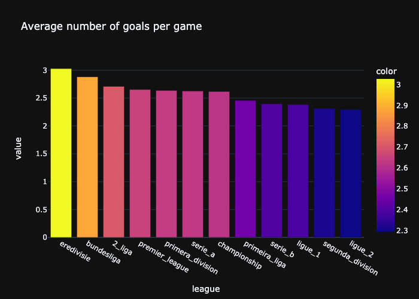

# Football Outcome Predictions
My forth and final project for AiCore. Building a machine learning model to make predictions for upcoming games and set odds for betting companies to maximise profit.

## Milestone 1: Project Setup

- A new conda environment has been set up with the name ```football-env``` from which the package requirements needed for the projects can be created in a ```requirements.txt``` file. Git branches will be used throughout the project following the Gitflow branching model.

<p align='center'>
  
</p>

> The simplified Gitflow branching model.

## Milestone 2: Data Cleaning and EDA

Exploratory Data Analysis (EDA) is the first step that must be undertaken before creating any form of model. It involves validating that the data provided is clean and free of missing values so as not to cause problems when working with such large quanities of data later down the line. By exploring this data, a rough understanding of the underlying trends between the variables can begin to be established.

### Data Cleaning

After concatenating the data provided into a singular dataframe ```main_df``` and running the ```describe()``` method on it, several key pieces of information show up:
- The data contains information from 142536 matches spanning 32 years across 14 different leagues.
- There is a discrepancy between the total number of links (142536) and the number of unique links (128379). Reasons for this could be some matches do not contain a link, contain the wrong link or there may be duplicates of matches in the dataframe.
- There is a discrepancy between the number of unique home teams (533) and the number of unique away teams (540). These too, should in theory have the same value.

Missing data can be visualised using the ```missingno``` package and running ```missingno.matix(main_df)```.

<p align='center'>
  
</p>

> Gaps in the plot show missing values such as ```NaN```.

The data is cleaned with a function perfoming the following:
- Duplicated rows with identical links removed with ```match_df.drop_duplicates('clean_link', inplace=True)```. Using ```main_df[main_df.duplicated('clean_link', keep=False)]```, it is revealed that the problem leagues containing the majority of duplicates are the Eerste Divisie and Segunda Liga, with a small minority from Ligue 1 and Serie B.
- The ```referee``` column is cleaned up to remove the ```\r\n``` on either side of the name. Care is taken when applying the ```clean_referee()``` function to the series to avoid any ```NaN``` floats. 
- The ```capacity``` column is cleaned and converted to an integer value where the value is not ```NaN```.

```python
df['referee'] = df['referee'].apply(lambda x: x.split('\r\n')[1][9:] if type(x)==str else x)
df['capacity'] = df['capacity'].apply(lambda x: int(x.replace(',', '')) if type(x)==str else x)
```
> Cleaning the ```referee``` and ```capacity``` column using ```lambda``` functions and the ```apply()``` method.

The number of rounds in each season for each league is plotted as a function of time. While this figure is a little convoluted, it is useful to observe potential gaps in the dataset. It is to be expected that each league plays 30-46 rounds, so it is evident the Championship is a problmeatic dataset. After inspecting, it can be seen that there is incomplete data for the years 1990-1994 and 1998 (which will be dropped), and missing data between 2006 and 2020. The drop in rounds in the 2. Bundesliga in 1992 may initially be understood as incomplete data, however after futher research it is apparent that this is due to the league being briefly split in two after teams from East Germany joined the league. The majority of the data for the Eerste Divisie and Segunda Liga is missing as each season only contains information on the first round. As a result of this, little usefeul information can be able to be extracted so data from these two leagues will be dropped. The final dip in total rounds played can be explained by the data being collected while the 2021 campaign was still in progression.

<p align='center'>
  
</p>

This leave 127416 rows of data from 12 leagues to analyse, and brings the number of unique home teams and away teams to 499 and 498 respectively.

### Analysis

Combining the home and away goals, a bar chart can be produced to show the average number of goals per game for the various leagues. As can be seen, all the leagues have a similar average of around 2.5 goals per game, with the Dutch Eredivisie coming in at the highest with an avergae of about 3, and the French Ligue 2 the lowest at roughly 2.3 goals per game.

<p align='center'>
  
</p>

By creating a new column in the dataframe and assigning each home win, draw and away win a score of 1, 0 and 1 respectively, a line graph can be plotted to see how the average outcome of all leagues has changed over the years. In theory, this value would remain at 0 indicating the same number of home and away wins, however in reality we that the earlier years had a heavy bias towards home wins. What is interesting is that over the years, this bias is reducing leading to a much more equal probability of the away team winning especially in recent years.

<p align='center'>
  
</p>

In order to investigate the effect that the stadium size has on the outcome of a game, a scatter graph has been plotted with an ordinary least squared regression trendline. The positive gradient of this line demonstrates that the home team is more likely to win when their stadium is larger, however this may partly be a result of stronger teams having larger capacity stadiums.

<p align='center'>
  
</p>

Similarly, the number of cards per game a home team receives is plotted as a function of stadium capacity. Here the trend is less pronounced, but  demonstrating a negative coefficient nonetheless. This is perhaps due to teams playing in smaller stadium being from lower leagues where the game is potentially a little more 'old school', resulting in more cardable offences. Furthermore, the home team is less likely to receive cards in comparison the away team.

<p align='center'>
  
</p>

Other data that could be looked at is the frequency of cards given by each referee, the number of draws per league and if the time of year affects the goals/outcome.

### Hypothesis

- The feature with the greatest impact on the result will be the past results of each club. Other important features will be the past number of goals score and conceeded and the stadium size.
- The features that will affect the yellow and red cards in a game will be the past number of cards the club has received and the referee of that game.
- Stadium size will have a impact on both these labels - the larger the stadium the larger the liklelihood of a home win and less cards received. 

More features will be added and inspected as the project progresses.

## Milestone 3: Feature Engineering

### ELO

The ELO is a points system which is given to each team in relation their previous results where the stronger a team is, the greater their ELO value. This value is calculated automatically by a predetermined algorithm after each game, but comparing the two teams score will almost certainly be a key feature in predicting the outcome of games. This data is loaded using ```pickle``` and merged into the main dataframe.
```python 
elo_dict = pickle.load(open('elo_dict.pkl', 'rb'))
elo_df = pd.DataFrame.from_dict(elo_dict)
elo_df = elo_df.transpose().reset_index().rename(columns={'index': 'Link'})
```

### Goals Scored So Far

As stated in the hypothesis, the number of goals scored that season by a team prior to the fixture taking place is likely to influence the number of goals scored by said team, and hence the outcome of the match. Calculating this is relatively simply, but to create a singular function that will iterate over the entire ```main_df``` dataframe is a little more complex and will require several nested ```for``` loops.
- Initially, one club was looked at from a singular season in order to establish the inner most ```for``` loop. Goals scored by this team so far in the competition was calculated by creating a dictionary with the key as the club name, and the value as a list of goals scored. The next value of the list is calculated by summing the previous two values.

  ```python
  season_df = goals_df[(goals_df['season'] == i) & (goals_df.league == league) & ((goals_df.home_team == team) | (goals_df.away_team == team))]
  scored_sofar_dict = {}
  scored_sofar_dict[team] = [0]
  for j in season_df['round'].unique():
    match = season_df.loc[(season_df['round'] == j) & ((season_df['home_team'] == team) | (season_df['away_team'] == team))]
    if match.home_team.item() == team:
        scored_sofar_dict[team].append(match.home_goals.item())
        scored_sofar_dict[team][j] += scored_sofar_dict[team][j-1]
    else:
        scored_sofar_dict[team].append(match.away_goals.item())
        scored_sofar_dict[team][j] += scored_sofar_dict[team][j-1]
  ```

- These value are then inserted into ```main_df```.
- Then, this loop is iterated over all teams in the current season, before being iterated over all seasons in the league before finally being iterated over all leagues in the dataframe.


### Goals Conceeded So Far

### Goal Difference So Far

### Points So Far

## Milestone 4: Uploading to a Database

## Milestone 5: Model Training

## Milestone 6: Inference
