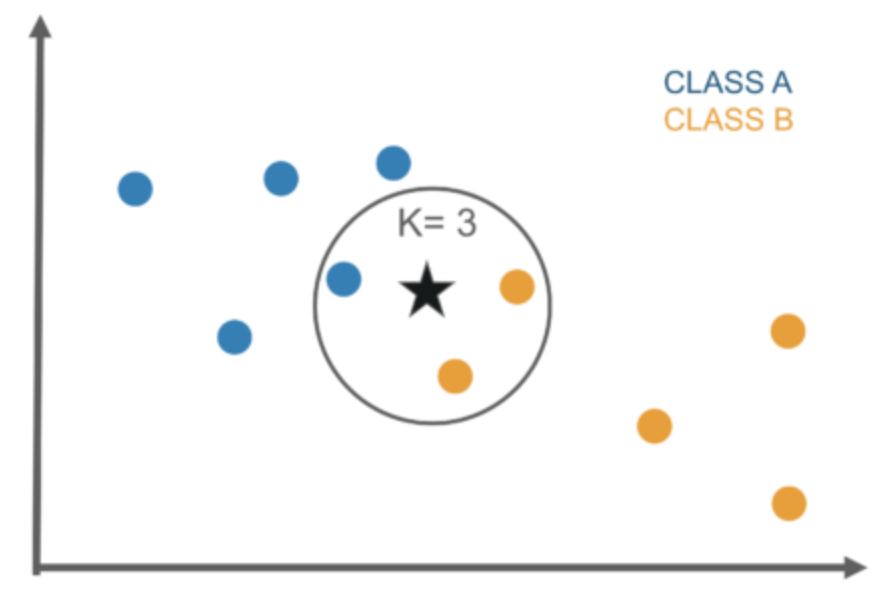
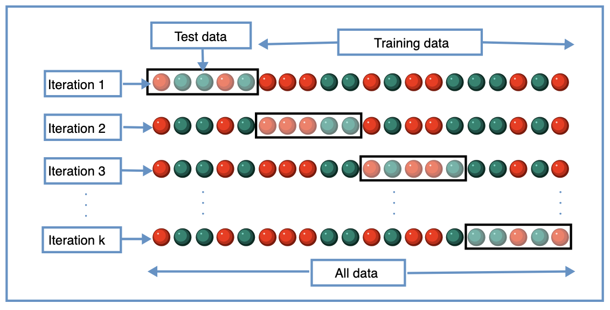

# K-Nearest Neighbours

## Theory


The KNN algorithm works to classify new data based on its proximity to the K nearest data points (neighbours). This calculates and average of their respective regression values (for regression), or a majority voting (for classification).

<p align='center'>
  
</p>

In the example above, the three nearest data points are included in the neighbourhood of the starred data as ```K=3```. Since the majority of these data points within this boundary are Class B, the starred data is included in Class B.

Limitations include:
- Complexity of algorithm dominated by having to calcualte the distance between each point and every other point int he neighbourhood
- Neighboring points may be close in feature space, but not in label space e.g. if they have similar values for features that do not influence the output label
- The whole dataset must be stored in the model when making predictions

## Hyperparameters

-	```n_neighbors```, the number of neighbours
-	Leaf size, the leaf sized passed into the algorithm
-	```p```, power parameter for the Minkowski metric (p=1 for Manhattan distance, p=2 for Euclidean)

## K-Fold Validation & Grid Search

Grid Search and K-Fold Validation are algorithmic ways to find hyperparameters. Grid search consists of a grid of possible hyperparameters with each combination used to tune the algorithm of choice and validate the results.

The main downside of Grid Search is that information on previous trials is not stored, and therefore every combination of hyperparameters are tried leading to long computation times. This makes it impossible to use with a large hyperparameter space.

K-Fold splits the dataset into multiple parts which are in turn used for training and validation.

<p align='center'>
  
</p>

Algorithmically this goes:
1. Split data into ```K``` parts
2. Set ```i=0```
3. Take parts ```[i]``` as the validation set and the rest as the training set
4. Train the model with the training set
5. Calculate and save metrics on validation set
6. Increment ```i``` and repeat until last section is used as the validation set
7. Take the mean of the validation results

K-Fold is the de facto standard in machine learning as evaulation on single validation sets can be very noise leading to a wide variation in results. This gives us false impressions about the model performance as it usually does worse than expected. On the other hand, it is not standard in the deep learning community due to the amount of time K-Fold can take. E.g. for 5 splits, 5 separate models must be trained which is infeasible for larger models which may take weeks to train.

Grid Search and K-Fold can be used in conjunction with eachother.


## Implementing with Scikit-learn

```python
n_neighbors = list(range(9,10))
leaf_size = list(range(5,10))
p=[1,2]

hyperparameters = dict(leaf_size=leaf_size, n_neighbors=n_neighbors, p=p)
knn = KNeighborsClassifier()
clf = GridSearchCV(knn, hyperparameters, cv=10)
best_model = clf.fit(X, y)

print('Best leaf_size:', best_model.best_estimator_.get_params()['leaf_size'])
print('Best p:', best_model.best_estimator_.get_params()['p'])
print('Best n_neighbors:', best_model.best_estimator_.get_params()['n_neighbors'])
```

## Results
