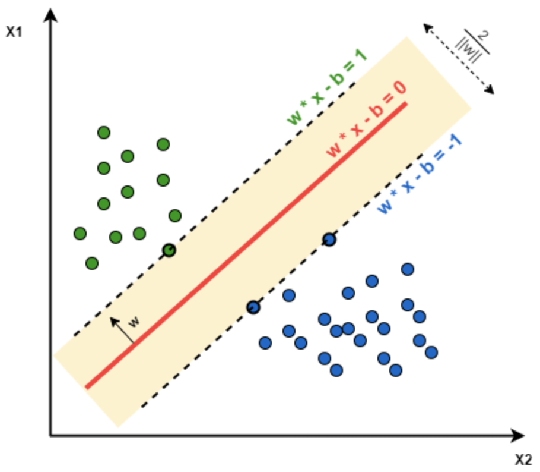
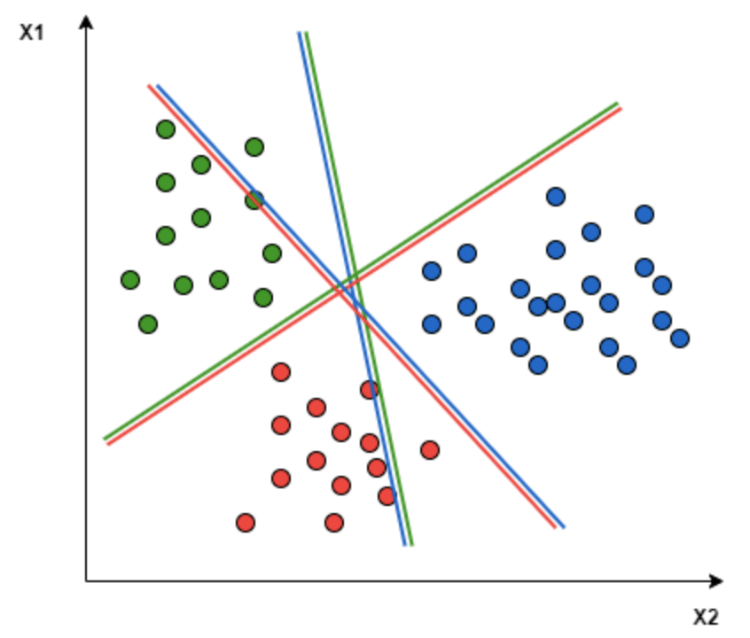
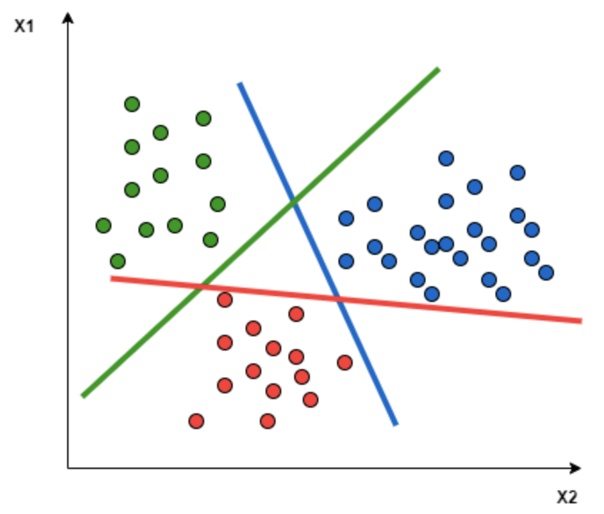
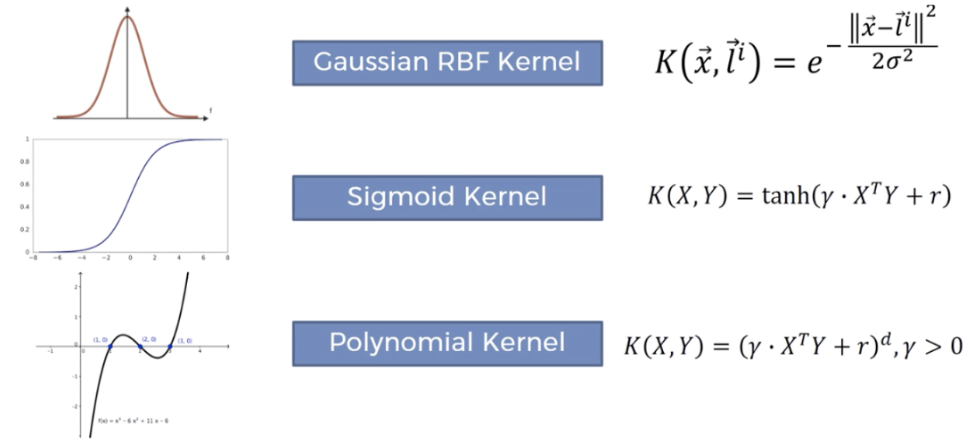
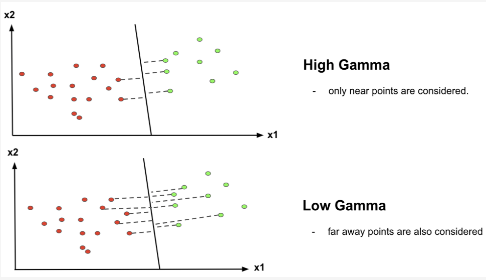

# Support Vector Machines (SVMs)

## Theory

SVM is a supervised machine learning algorithm used in both classification or regression problems. It aims to find an optimal boundary between the possible outputs. The objective is to find a hyperplane (red in the example below) that maximises the separation of data points to the potential classes in an n-dimensional space. The data points closest to the hyperplane are called Support Vectors.

<p align='center'>
  
</p>

SVM supports binary classification and so for multiclass classification problems the problem is broken down into multiple binary classification problems. This is done by either using a 'One-to-One' approach (binary classifier per pair of classes) or a 'One-to-Rest' approach (binary classifier per class).

<p align='center'>
  
   
</p>

> 'One-to-One' on the left, 'One-to-Rest' on the right.

## Hyperparameters to be tuned

1.	```C```
    - The regularisation (penalty) parameter
    - Represents misclassification or error term (how much is tolerated by the model)
    - Controls the trade-off between decision boundary and misclassification term
        - A large ```C``` will classify all data points correctly which could lead to overfitting
2. ```kernel```
    - Specifies the kernel type to be used in the algorithm
    - Takes low dimensional input space and transforms it into a higher-dimensional space
    - Mostly useful in non-linear separation problem
3. ```gamma```
    - Kernel coefficient for ‘rbf’, ‘poly’ and ‘sigmoid’
    - Defines how far influences the calculation of plausible line of separation
    - A large gamma will mean nearby points will have high influence; A low gamma means far away points also be considered

<p align='center'>
  
  
</p>

> Some examples of SVM kernals (left) and how ```gamma``` affects the decision boundary (right)