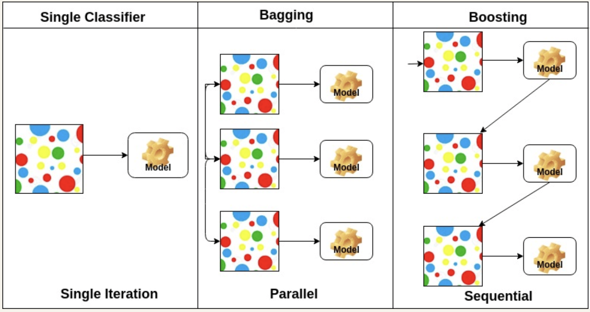

# AdaBoost Classifier

Boosting algorithms work to build a stronger model from the mistakes of several weaker ones. Adaptive Boosting (AdaBoost) works with 'decision stumps', which are similar to trees in Random Forest but are not fully grown i.e. have one node and two leaves. Unlike bagging, boosting is an iterative process which can be seen below.

  

> A comparison of a single and ensemble models.

Advantages:
- Theoretically not prone to overfitting
- Easy to use as few hyperparameters
- Can be used in conjunction with multiple weaker models, not just decision trees

Disadvantages:
- As boosting learns progressively, it is important to ensure the data is of a good quality
  - Boosting extremely sensitive to noise
- Slower than XGBoost

## Theory

The algorithm works as follows.

1. A weak classifier (decision stump) is made on top of the training data base on the weighted samples. The weight of each sample indicates how important it is to be correctly classified, but for the first stump all samples will have equal weights.

2. A decision stump for each variable to see how well they classify samples to each of their target classes.

3. More weight is assigned to the incorrectly classified samples so they are classified correctly in the next decision stump. Weight is also assigned to each classifier based on the accuracy of the classifier i.e. higher accuracy will have a higher weight.

4. Reiterate from Step 2 until all data points have been correctly classified, or the maximum iteration level has been reached.

## Hyperparameters to be tuned

1. `n_estimators`
    - The maximum number of estimators at which boosting is terminated
2. `learning_rate`
    - Weight applied to each classifier at each boosting iteration
    - A higher learning rate increases the contribution of each classifier
    - Often a trade of between `learning_rate` and `n_estimators`