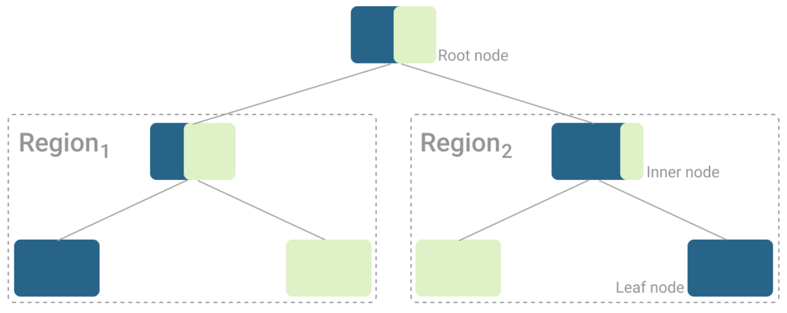
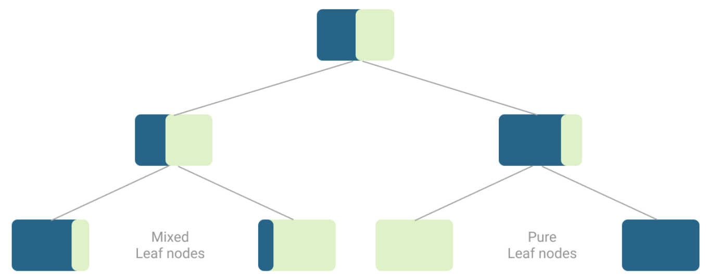

# Decision Tree Classifier

## Theory

Decision trees work by asking a series of yes/no questions to continutally split the data. The answer at each node reveals more information on the class of an object until the range of possible options becomes fine enough to settle on a prediction.

<p align='center'>
  
</p>

> Example of a tree with only pure leaf nodes.

It is unlikely to end up with a only pure leaf nodes, and more times than not there will be several mixed leaf nodes where the algorithm assigns the most common class.

<p align='center'>
  
</p>

> Example of a tree with pure and mixed leaf nodes, before assigning the final classes to each node.

A key advantage of tree-based algorithms is that it is actually possible to see how the different data points are classified, unlike most algorithms which work like blackboxes.

## Hyperparameters to be tuned

1. ```criterion```
    - A loss function to measure the impurity of the split
    - Gini Impurity is a measure of variance across the different classes
    - Entropy is a measure of chaos within a node, but may take longer to compute due to as it contains a logarithmic function
2. ```max_depth```
    - The maximum depth of the tree
    - If ```None```, then nodes are expanded until all leaves are pure or until all leaves contain less than min_samples_split samples
    - If too high will often lead to overfitting
