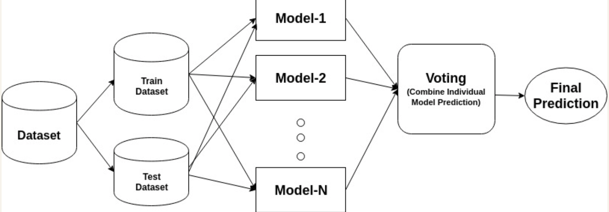
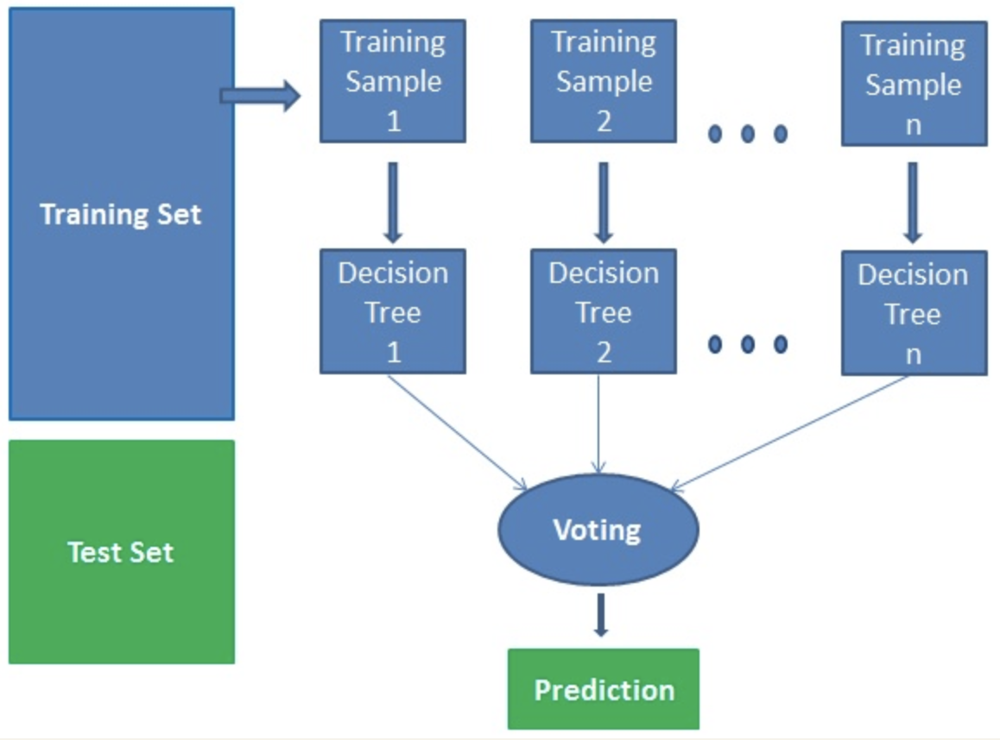

# Random Forest Classifier

The Random Forrest Algorithm is technically an ensemble method as it utilises a number of decision trees generated on a randomly split dataset. This collection of classifiers is what is known as the forest. In a classification problem, each tree votes and the most popular class is chosen as the final result. In the case of regression, the average of all the tree outputs is considered as the final result.

<p align='center'>
  
</p>

> The appraoch of ensemble algorithms.

## Theory

The algorithm works in four steps:

1. Select a number of random samples from a given dataset
2. Construct a decision tree for each sample and get a prediction result from each tree
3. Perform a vote for each predicted result
4. Select the predicted result with the most votes as the final prediction

<p align='center'>
  
</p>

> The Random Forest algorithm for ```n``` training samples.

'Bootstrap aggregation', or 'bagging' combines multiple learners in a way to reduce the variance of estimators. E.g. random forest trains ```n``` decision trees, bagging will use```n``` different trees on different random subsets of the data and perform voting for a final prediction.

Advantages:
- Does not suffer from overfitting as it takes an average of all predictions, which cancels out the biases
- Can handle missing values by using median values for continuous variables, and computing the proximity-weighted average of missing values

Disadvantages:
- Can take a lot longer in comparison to other methods due to the multiple decision trees at each level
- Harder to follow visually in comparison to a singular decision tree, where the path can easily be followed

## Hyperparameters to be tuned

1. ```n_estimators```
        - The number of trees in the forest
2. ```criterion```
        - The function to measure the quality of a split
        - This will be decided between ```'gini'``` and ```'log_loss'```
3. ```max_depth```
        - The maximum depth of the tree
4. ```bootstrap```
        - Whether bootstrap samples are used when building trees
        - If ```True```, bagging is used and each tree is trained on a subset of the training data
        - If ```False```, the whole training dataset is used to build each tree
5. ```max_samples```
        - The number of samples to draw from X to train each base estimator if bootstrap is ```True```
